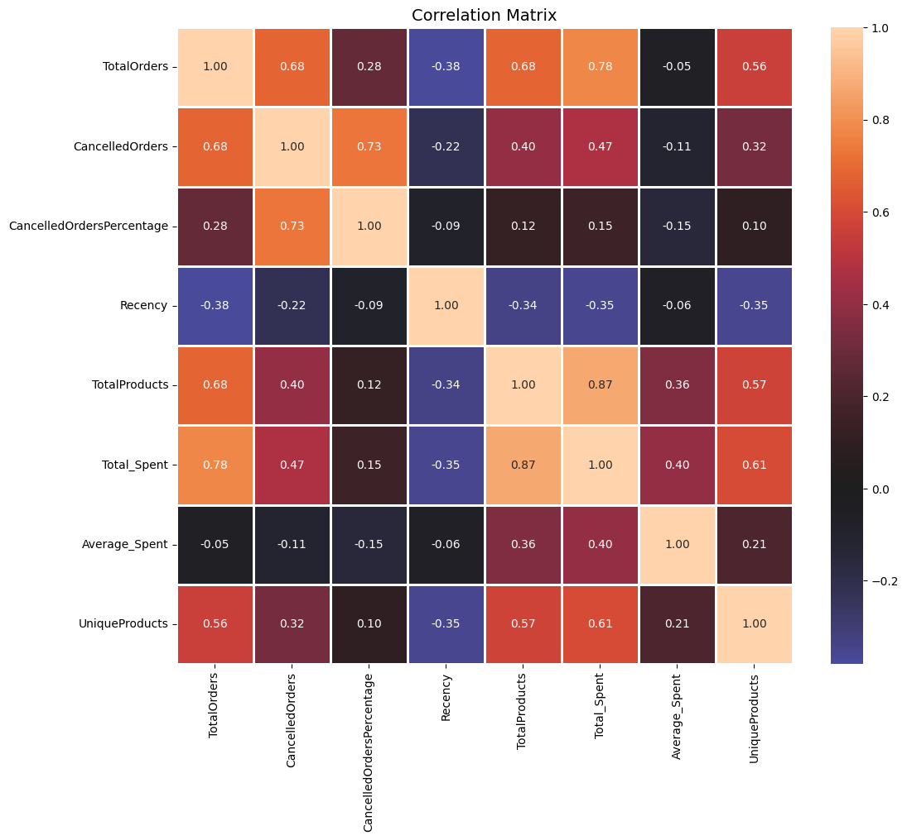
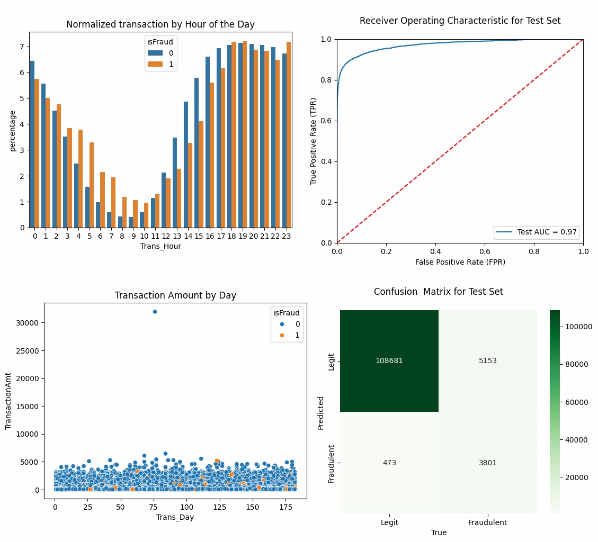
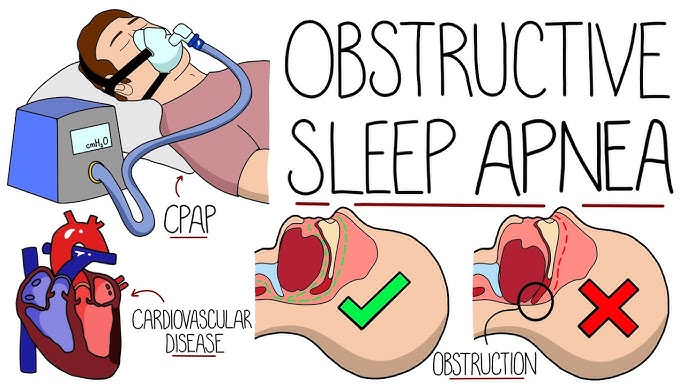
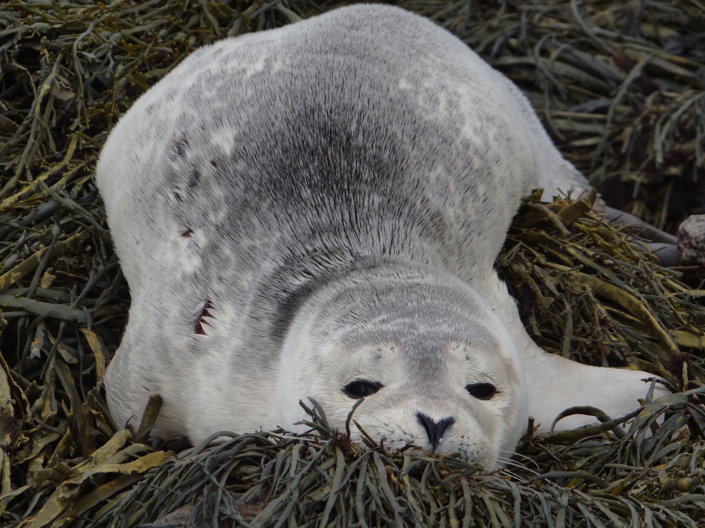

# Portfolio

---

## Personal Project
### [Retail Customer Segmentation & Recommendation System](https://github.com/giauyen123/Customer-Segmenation-and-Recommendation-System)

### [Customer Transaction Fraud Detection](https://github.com/giauyen123/Customer-Transaction-Fraud-Detection)

### [Adult Income Analysis and Forecast](https://rpubs.com/giauyen123/1070743)

---
## Research Project

### [Prediction of Apnea Hypopnea Index (AHI) for Obstructive Sleep Apnea Diagnosis based on Using Sleep Tracking Wearable Devices](/researchposter.pdf)

---

### [Tidal and meteorological effects on Harbor Seals (Phoca Vitulina) and Gray Seals (Halichoerus Grypus) haul-out behavior in the Gulf of Maine](/sealanalysis.pdf)

---
